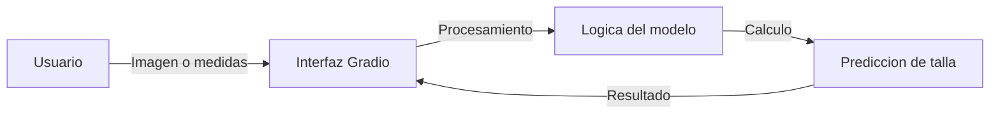
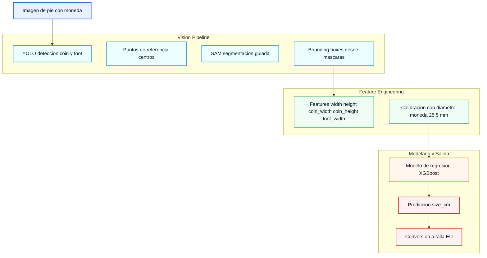

# Shoe Sizer

Python-based tool for shoe size estimation, using an interactive web interface built with Gradio.

## Description

Shoe Sizer allows users to easily get shoe size recommendations. The project uses Gradio for the frontend, facilitating interaction with the processing logic in Python.

## Installation

The project uses Python 3.12.

1. Activate the virtual environment:
   ```bash
   source .venv/bin/activate
   ```

2. Install dependencies (if necessary):
   ```bash
   pip install -r requirements.txt
   ```

## Usage

To start the application:

```bash
python app.py
# Note: Replace 'app.py' with the name of your main script if different.
```

## Arquitectura

### Flujo de Datos
Este diagrama muestra cómo viajan los datos desde el usuario hasta obtener la predicción.



### Arquitectura del Pipeline
Pipeline observado en los notebooks de `experiments` para estimar talla desde imagen.


