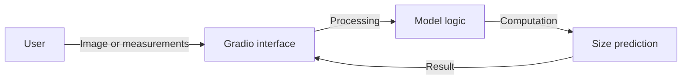
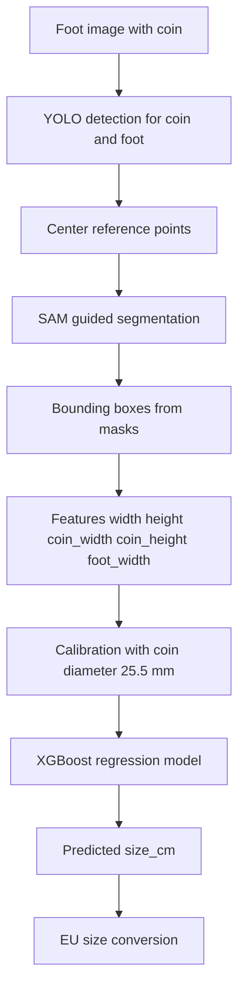

# Shoe Sizer

Python-based tool for shoe size estimation, using an interactive web interface built with Gradio.

## Description

Shoe Sizer allows users to easily get shoe size recommendations. The project uses Gradio for the frontend, facilitating interaction with the processing logic in Python.

## Installation

The project uses Python 3.12.

1. Activate the virtual environment:
   ```bash
   source .venv/bin/activate
   ```

2. Install dependencies (if necessary):
   ```bash
   pip install -r requirements.txt
   ```

## Usage

To start the application:

```bash
python app.py
# Note: Replace 'app.py' with the name of your main script if different.
```

## Architecture

### Data Flow
This diagram shows how data moves from the user to the final size prediction.



### Pipeline Architecture
Pipeline observed in the `experiments` notebooks to estimate size from an image.



## Authors


| Avatar | Name | Role | Links |
|---|---|---|---|
|  | Diana Sánchez | Full Stack & Data Scientist |[LinkedIn](https://www.linkedin.com/in/diana-sanchez-ordonez/) |
|  | Robert J. Buleje| DI Analyst & Data Scientist |[LinkedIn](https://www.linkedin.com/in/rjbuleje/) |
|  | Giancarlo Poémape| Data Engineer & ML Engineer |[LinkedIn](https://www.linkedin.com/in/giancarlopoemape/) |

